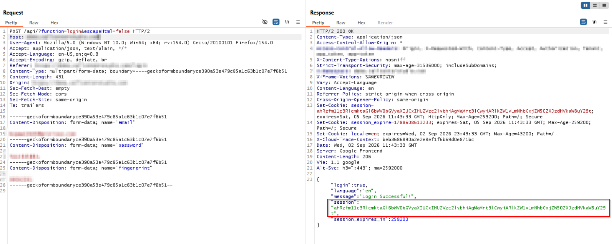
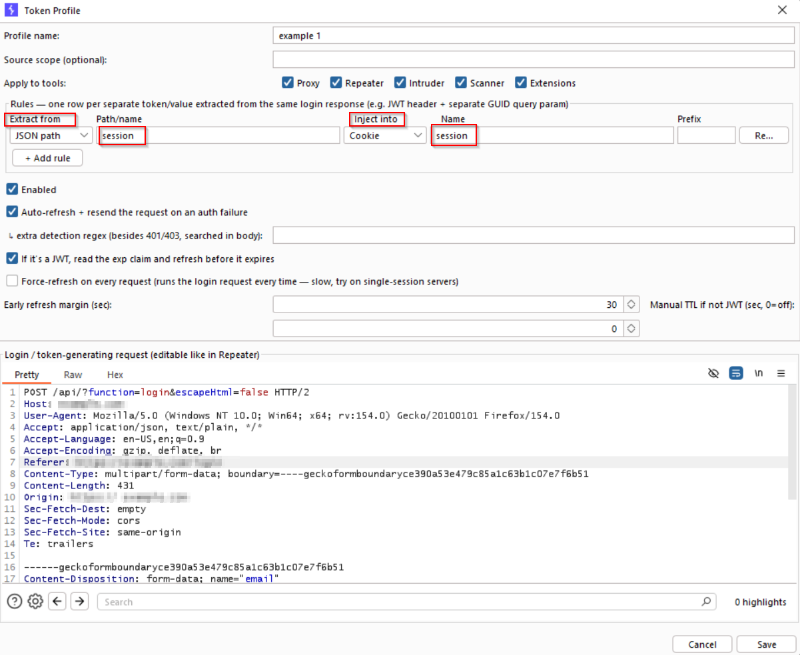
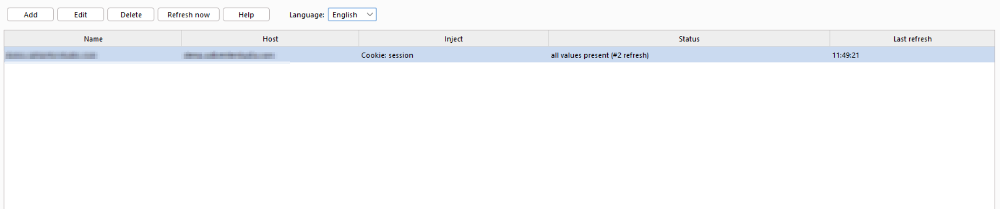
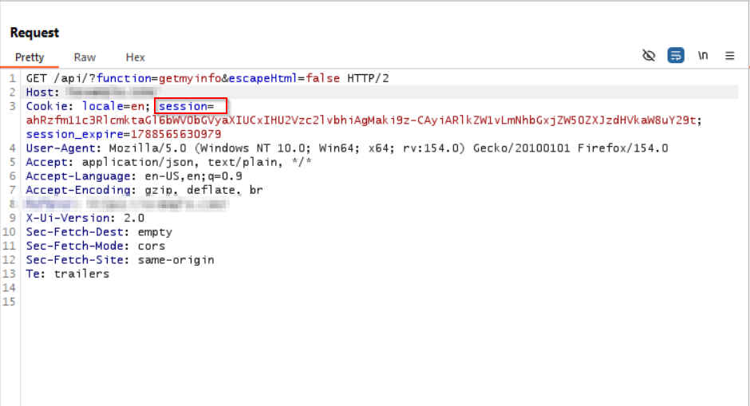

# Token Auto-Refresher (source)

Source code for the [Token Auto-Refresher](https://github.com/HCIBO/token-auto-refresher) Burp Suite extension, published here for BApp Store review. The compiled/release jar lives in the [binary repo](https://github.com/HCIBO/token-auto-refresher).

A Burp Suite extension (Montoya API) that keeps auth tokens fresh across **Proxy, Repeater, Intruder, Scanner and Extensions** automatically — no more hunting down every tab to swap in a new token by hand after it expires.

## The problem

During a pentest you spread requests across Scanner, Intruder and Repeater. Session/JWT tokens expire (overnight, mid-engagement, or on a single-session server that invalidates old tokens on every login). Normally you have to manually find and replace the token header in every tool, every time.

## What it does

- **Register any request as a "login"** (right-click in Proxy/Repeater history → *"use as login (token) request"*, or add one manually).
- **Extracts the token** from that response — JSON path, regex, response header, or `Set-Cookie` — and **injects it** into a header, cookie, or URL query param on all matching outgoing traffic.
- **Multiple credentials per login**: one login response can hand back more than one value (e.g. a JWT for the `Authorization` header *and* a separate GUID session token for a query param) — add multiple extraction/injection rules to a single profile, all refreshed together in one login call.
- **Proactive refresh**: decodes the `exp` claim if the token is a JWT and refreshes before it expires; falls back to a manual TTL for non-JWT tokens.
- **Reactive refresh**: on HTTP 401/403, *or* on a custom regex match in the response body (for APIs that signal an expired session with `HTTP 200` + an app-level error envelope) — refreshes the token and **automatically resends the failed request**, transparently.
- **Force-refresh-per-request** option for servers that invalidate the previous session on every new login.
- Applies per-profile to any combination of Proxy/Repeater/Intruder/Scanner/Extensions, scoped by host.
- UI available in **Turkish, English and French**.

## How it works

Uses Montoya's `HttpHandler` to intercept every outgoing request from every Burp tool at a single choke point (`core/RefresherHttpHandler.java`). For each enabled profile matching the request's host/tool scope, it makes sure the token is fresh (refreshing via the stored login request if needed) and rewrites the request before it goes out on the wire.

## Project layout

```
src/main/java/tokenrefresher/
  TokenRefresherExtension.java   entry point (implements BurpExtension)
  core/                          HttpHandler, extraction, JWT exp decoding
  model/                         TokenProfile / TokenRule / enums
  store/                         persistence + in-memory registry
  ui/                            suite tab, profile editor dialog, context menu
  i18n/                          TR/EN/FR string table
```

## Build

Gradle (wrapper included, no local Gradle install needed) — just JDK 17+:

```bash
./gradlew shadowJar
```

`montoya-api` (`compileOnly`, provided by Burp at runtime) and `gson` (bundled) are pulled from Maven Central automatically. Produces `build/libs/token-auto-refresher.jar`, loadable directly via Burp → Extensions → Add → Java.

## Screenshots

First, look at your login (token-generating) request and figure out where in the response the token value actually lives — the extension supports every common location. In our example, the response returns it as a session field inside the JSON body.

Right-click that request and select Extensions → Token Auto-Refresher to hand it over to the extension.



The Token Profile window opens. Profile name can be anything you like.

In Extract from, pick where the token value is — since ours is in the JSON body, we select JSON path, and in Path/name we give the token's parameter name.

Next, Inject into — this tells the extension where the token goes in outgoing requests. In our example it's stored in a Cookie named session. If it were a JWT instead, we'd put Authorization in the Name field and Bearer in Prefix. Sometimes there's no prefix at all — in that case just enter Authorization and leave Prefix empty.

Once that's set, click Save.



Back on the Token Refresher screen, click Refresh now and the token kicks in. From this point on, Proxy, Repeater, Intruder, Scanner and Extensions — whichever you've enabled — automatically continue every request with the fresh token. No manual swapping needed, ever.

The UI is available in English, French and Turkish if you'd like to switch.

Note: if a request needs more than one header/value, add extra rows with Add rule. If you want a brand-new token fetched on every single request, enable the Force-refresh option.



Now, whether you send a request or run a Scanner scan, the process will continue seamlessly with the new token.


